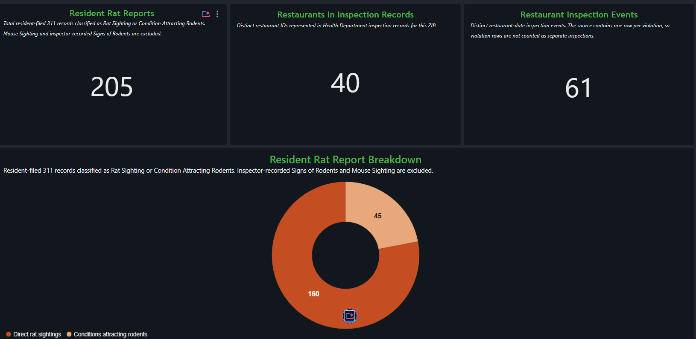
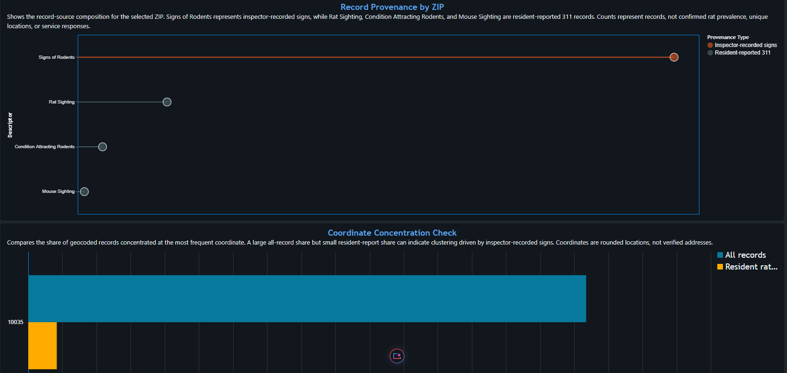
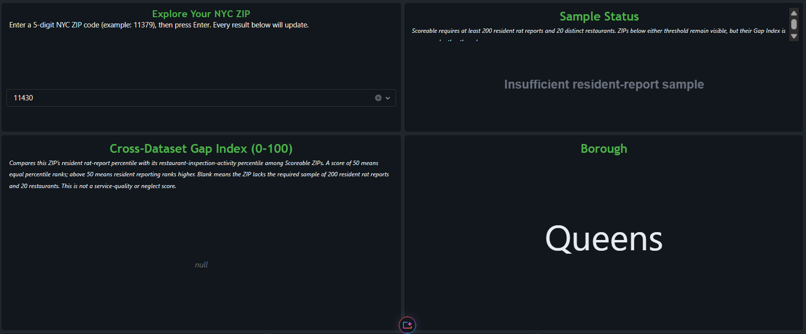
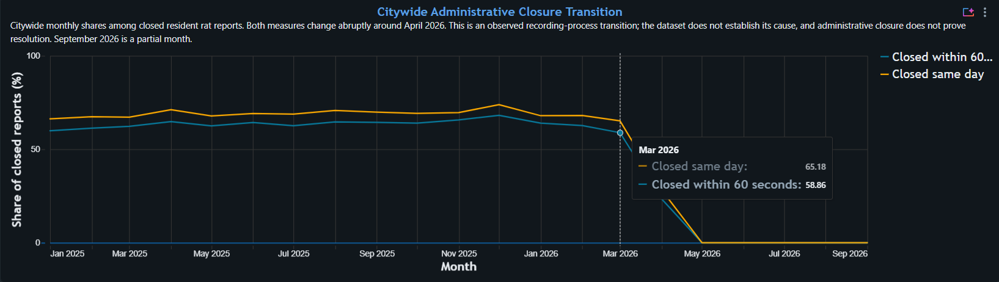

# Does the City Show Up? — NYC ZIP Explorer

> A Databricks analysis comparing resident rat-report pressure with restaurant inspection activity across NYC ZIP codes.

## Project Status

This repository contains a **post-hackathon Version 2** developed after our original AI Databricks Hackathon @ Queens College presentation. V2 incorporates judge feedback and corrects issues involving record provenance, dataset grain, small samples, coordinate concentration, and administrative closure timing.

## Team

- [Taseen Ariq](https://www.linkedin.com/in/taseenariq06/?trk=opento_sprofile_details)
- [Kelly Chen](https://www.linkedin.com/in/kelly-chen-a3b2a9437/)
- [Mahira Sharif](https://www.linkedin.com/in/mahira-sharif-a083173a0/)

## Links

- **Interactive dashboard:** [Databricks Dashboard](https://dbc-5f5c0858-d1a8.cloud.databricks.com/dashboardsv3/01f1b8414d6f1ea1a512b769d302ee46/published?o=7474659023620294)
- **Devpost submission:** [Devpost Link](https://devpost.com/software/does-the-city-show-up-nyc-zip-explorer?ref_content=my-projects-tab&ref_feature=my_projects)

## Inspiration

NYC publishes both rat-related 311 records and restaurant health-inspection violations, but the datasets do not directly show whether ZIP codes with high resident reporting pressure also show comparable restaurant inspection activity.

We investigated a more useful question than “Where are the most rats?”:

> **When residents report a problem, does the public data show corresponding city activity?**

We avoided labeling ZIP codes as the “worst rat neighborhoods.” A 311 dataset measures reporting behavior, not the true rat population. Awareness of 311, language access, available time, and trust in government can all affect reporting.

Restaurant inspections also cover commercial food establishments, while 311 records include residential and public locations. These datasets represent different signals and are not linked responses to one another.

## What We Built

**Does the City Show Up? — NYC ZIP Explorer** is an interactive Databricks dashboard and Genie Agent that allow users to enter an NYC ZIP code and examine:

- Resident rat reports
- Direct rat sightings versus conditions attracting rodents
- Inspector-recorded signs shown separately from resident reports
- Recorded complaint-location categories
- Administrative complaint status
- Distinct restaurants represented in inspection records
- Distinct restaurant-date inspection events
- Restaurants with documented rat or mouse findings
- Resident-report and restaurant-inspection percentile rankings
- Coordinate-concentration warnings
- Data-sufficiency status
- A ZIP-level Cross-Dataset Gap Index

A second **Data Quality Audit** page exposes the provenance, concentration, and administrative-closure issues that could otherwise produce misleading conclusions.

ZIP codes with insufficient samples remain visible, but their scores and percentiles are suppressed rather than displayed as zero.

## Data and Grain

We used Databricks SQL to clean, validate, and aggregate two NYC Open Data files covering approximately January 2025 through September 2026.

The raw inspection source contained approximately 158,000 rows at the **violation grain**. One restaurant inspection can therefore produce several rows.

After filtering invalid fields and removing exact duplicates, the cleaned inspection data contains:

- **156,300 violation rows**
- **25,772 distinct restaurants**
- **43,952 distinct restaurant-date inspection events**

These entities must be counted separately:

| Entity | Definition |
|---|---|
| Violation row | One documented violation code |
| Inspection event | One restaurant on one inspection date |
| Restaurant | One distinct restaurant identifier |
| Resident rat report | One resident-filed Rat Sighting or Condition Attracting Rodents record |
| ZIP summary | One aggregated row per ZIP code |

## Provenance Definition

The 311 source contains four descriptors that do not all represent the same process:

| Descriptor | V2 classification | Included in resident rat metric? |
|---|---|---:|
| Rat Sighting | Resident-reported 311 | Yes |
| Condition Attracting Rodents | Resident-reported 311 | Yes |
| Mouse Sighting | Resident-reported 311 | No |
| Signs of Rodents | Inspector-recorded signs | No |

The V2 resident-rat metric therefore includes only:

- `Rat Sighting`
- `Condition Attracting Rodents`

`Mouse Sighting` remains available for auditing but is excluded from the rat-specific index. `Signs of Rodents` is kept separate because it represents inspector language rather than a resident rat report.

## Data Model

V2 creates the following tables and views:

- `rat_clean_v2` — cleaned 311 records with provenance and timing flags
- `inspections_clean_v2` — deduplicated violation rows with restaurant and inspection identifiers
- `zip_summary_v2` — complaint and inspection measures aggregated to one row per ZIP
- `service_gap_index_v2` — scoreability rules, percentiles, warnings, and index values
- `zip_location_type_summary_v2` — resident rat reports by recorded location category
- `zip_descriptor_summary_v2` — descriptor and provenance composition by ZIP
- `zip_coordinate_concentration_v2` — all-record and resident-only coordinate concentration
- `monthly_closure_audit_v2` — monthly administrative closure distributions

For restaurant findings:

- `04K` represents documented rat evidence
- `04L` represents documented mouse evidence

Restaurants are counted distinctly even if they appear in multiple violation rows or inspection events.

## Cross-Dataset Gap Index

We calculate:

1. Resident rat reports per 100 restaurants
2. Distinct restaurant inspection events per 100 restaurants
3. The percentile rank of each rate among Scoreable ZIP codes

The index is:

```text
Cross-Dataset Gap Index =
50 + 50 × (resident-report percentile − inspection-activity percentile)
```

A score of 50 means the two rates have equal percentile rankings. A score above 50 means resident rat-report pressure ranks higher than restaurant inspection activity among Scoreable ZIPs.

The index is not a complaint-to-inspection ratio and does not measure whether individual complaints received inspections.

## Sample Safeguards

A ZIP is **Scoreable** only when it contains at least:

- **200 resident rat reports**
- **20 distinct restaurants**

These are analyst-defined stability safeguards. Of the 221 ZIP codes represented in the combined data, 81 satisfy both requirements.

ZIP codes below either threshold remain visible but receive:

- A descriptive insufficient-sample status
- A NULL index
- No percentile rankings

NULL means the score was intentionally suppressed. It does not mean zero.

## What We Found

### Largest V2 mismatch

ZIP **11379 in Queens** has the highest V2 index among the 81 Scoreable ZIPs:

- **205 resident rat reports**
- **40 distinct restaurants**
- **61 distinct inspection events**
- Resident-report percentile: approximately **92.5th**
- Inspection-activity percentile: approximately **6.3rd**
- Cross-Dataset Gap Index: **93.13**

This identifies a large cross-dataset mismatch. It does not prove neglect, inadequate service, or that individual complaints were ignored.

### Why provenance matters

ZIP **10035** contains:

- **239 resident rat reports**
  - 187 Rat Sightings
  - 52 Conditions Attracting Rodents
- **14 Mouse Sightings**
- **1,248 inspector-recorded Signs of Rodents**
- **1,501 total records**

Inspector-recorded signs constitute more than 80% of its records. Combining them with resident reports would create a severely distorted ZIP comparison.

### Coordinate concentration

In ZIP 10035:

- One coordinate represents approximately **81.75% of all geocoded records**
- The leading resident-rat-report coordinate represents only approximately **4.18% of resident rat reports**
- Nearly all records at the dominant all-record coordinate are inspector-recorded signs

The apparent ZIP-wide concentration is therefore driven primarily by inspector records at one rounded coordinate rather than broadly distributed resident rat reports.

Coordinates are rounded locations, not verified addresses.

### Administrative closure transition

For approximately fifteen months, around 60–68% of closed resident rat reports were recorded as closed within 60 seconds. The share dropped to approximately 23% in April 2026 and reached 0% from May through September 2026.

The last resident rat report recorded as closed within 60 seconds occurred on April 20, 2026.

This is an abrupt recording-process transition rather than a gradual seasonal pattern. The datasets do not establish its cause. Administrative closure also does not prove an investigation, site visit, remediation, or resolution.

September 2026 is a partial month.

### Small-sample protection

ZIP **11430** contains:

- 2 resident rat reports
- 88 restaurants
- 134 inspection events

The restaurant side is well represented, but two resident reports cannot support a stable resident-report comparison. The ZIP remains visible but receives no index.

The available datasets do not establish whether a ZIP is residential or non-residential. ZIP codes are geographic reporting areas, not neighborhoods.

## Dashboard Validation Cases

We tested the completed dashboard against several edge cases:

| ZIP | Expected result |
|---|---|
| 11379 | Scoreable; index 93.13 |
| 10035 | Scoreable; index 38.13; 1,248 inspector-signs records shown separately |
| 11423 | 37 resident rat reports; insufficient resident-report sample; blank index |
| 11415 | 51 resident rat reports; insufficient resident-report sample; blank index |
| 11430 | 2 resident rat reports; insufficient resident-report sample; blank index |
| 10312 | A 0th-percentile inspection rank means the lowest rate among Scoreable ZIPs, not zero inspections |

## Screenshots

### ZIP Explorer — 11379



### Data Quality Audit — 10035



### Insufficient-Sample Handling — 11430



### Citywide Administrative Closure Transition



## Challenges We Faced

The largest challenge was determining what each row actually represented. Counting inspection rows directly would have treated individual violations as separate restaurants or inspections.

Other challenges included:

- Separating resident reports from inspector-recorded signs
- Defining a reproducible resident-rat metric
- Normalizing ZIP codes across unrelated datasets
- Deduplicating exact inspection rows
- Distinguishing restaurants, inspections, and violations
- Preventing low-sample ZIP codes from winning percentage-based rankings
- Detecting concentration at a single coordinate
- Identifying the April 2026 administrative-closure transition
- Preventing “Closed” from being interpreted as proven resolution
- Connecting one ZIP filter to multiple dashboard datasets
- Creating readable Vega-Lite visualizations
- Teaching Genie the project’s definitions and limitations through metadata

## What We Learned

Data modeling mattered more than adding another visualization. The conclusion changes depending on whether the analysis counts:

- Violation rows
- Inspection events
- Restaurants
- All resident reports
- Resident rat reports
- Inspector-recorded signs
- Direct rat sightings
- Distinct coordinates

Transparent limitations make the analysis more useful. A high index identifies a ZIP where two public datasets rank recorded activity differently. It does not prove that the city failed to respond, that inspections were insufficient, or that the ZIP contains more rats.

## Technology

- Databricks SQL
- Databricks AI/BI Dashboards
- Databricks Genie
- Vega-Lite
- Git and GitHub

## Repository Structure

```text
├── README.md
├── sql/
│   ├── 01_clean_rat_records.sql
│   ├── 02_clean_restaurant_inspections.sql
│   ├── 03_zip_summary.sql
│   ├── 04_data_quality_audits.sql
│   ├── 05_service_gap_index.sql
│   └── 06_dashboard_support_tables.sql
├── screenshots/
│   ├── zip-11379-explorer.png
│   ├── zip-10035-audit.png
│   ├── zip-11430-insufficient-sample.png
│   └── closure-transition.png
└── docs/
    └── methodology.md
```

## SQL Running Order

Run the SQL files in numerical order. The later summary and index objects depend on the earlier cleaned views.

The raw source tables are expected at:

```text
workspace.default.rat_sightings
workspace.default.restaurant_inspections
```

The raw CSV files are not stored in this repository.

## Limitations

- 311 reports measure reporting behavior, not true rat prevalence.
- Restaurant inspections cover commercial food establishments rather than all reported locations.
- The datasets do not link individual complaints to inspections or remediation.
- Restaurant-normalized rates are not population-normalized rates.
- Administrative closure does not prove resolution.
- ZIP codes are not neighborhoods.
- Rounded coordinates are not verified addresses.
- The April 2026 closure transition is observable, but its cause cannot be determined from these datasets.
- September 2026 is a partial month.
- The 200-report and 20-restaurant thresholds are analyst-defined safeguards.

## What’s Next

A stronger version would incorporate:

- Complaint-to-response linkage
- Site-visit records
- Remediation outcomes
- Residential and non-restaurant pest-control activity
- Population or housing-based normalization
- Longer historical coverage
- Sensitivity analysis across alternative sample thresholds

These additions could move the project from identifying cross-dataset mismatches toward evaluating whether residents received effective responses.

## Closing

> **If we worked for the city, we would investigate high-gap ZIPs using linked response, remediation, and non-restaurant pest-control records, because our data shows that resident reporting pressure and restaurant inspection activity can diverge sharply, while the available public records cannot confirm whether individual complaints received effective service.**
